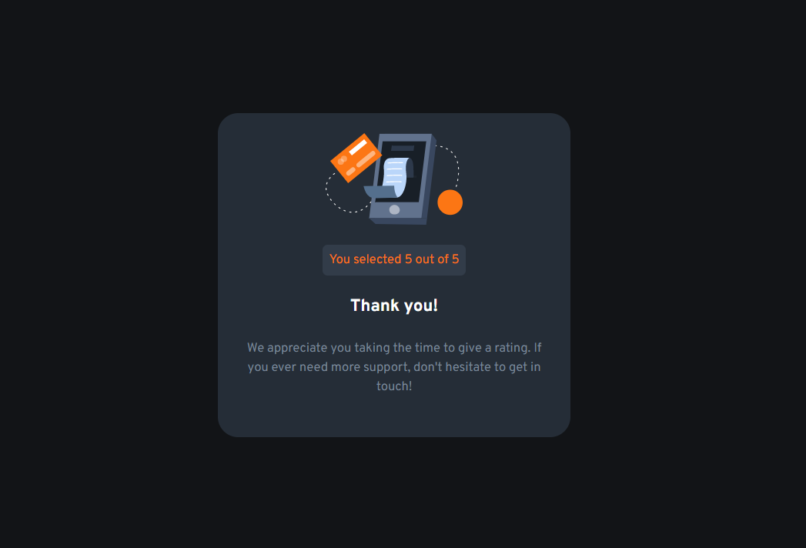

# Frontend Mentor - Interactive rating component solution

This is a solution to the [Interactive rating component challenge on Frontend Mentor](https://www.frontendmentor.io/challenges/interactive-rating-component-koxpeBUmI). Frontend Mentor challenges help you improve your coding skills by building realistic projects.

## Table of contents

- [Overview](#overview)
  - [The challenge](#the-challenge)
  - [Screenshot](#screenshot)
  - [Links](#links)
- [My process](#my-process)
  - [Built with](#built-with)
  - [What I learned](#what-i-learned)
  - [Continued development](#continued-development)
  - [Useful resources](#useful-resources)
- [Author](#author)

**Note: Delete this note and update the table of contents based on what sections you keep.**

## Overview

### The challenge

Users should be able to:

- View the optimal layout for the app depending on their device's screen size
- See hover states for all interactive elements on the page
- Select and submit a number rating
- See the "Thank you" card state after submitting a rating

### Screenshot

### Links

- Live Site URL: [Vercel](https://frontendmentor-io-three.vercel.app/)

## My process

### Built with

- Semantic HTML5 markup
- [Vite](https://vitejs.dev/)
- [React](https://reactjs.org/)
- [TailwindCSS](https://tailwindcss.com/)
- [headlessui](https://headlessui.dev/)

### What I learned

In this challenge I learned to use TailwindCSS with there responsive utility classes. I also used Vite the first time. I tried to reuse the markup (created components).
I know that its possible to create more components, but I think i have found a nice compromise

### Continued development

Nothing is perfect, so I have a few ideas to improve this solution.

- use TypeScript to be type safe
- create more components (i.e. Headline, Paragraph)
- create a nice fade effect, after submitting
- ...

### Useful resources

- [TailwindCSS Documentation](https://tailwindcss.com/docs/installation)
- [headlessui RadioGroup component](https://headlessui.dev/react/radio-group)

## Author

- Website - [schman](https://schman.dev)
- Frontend Mentor - [@schmanat](https://www.frontendmentor.io/profile/schmanat)
